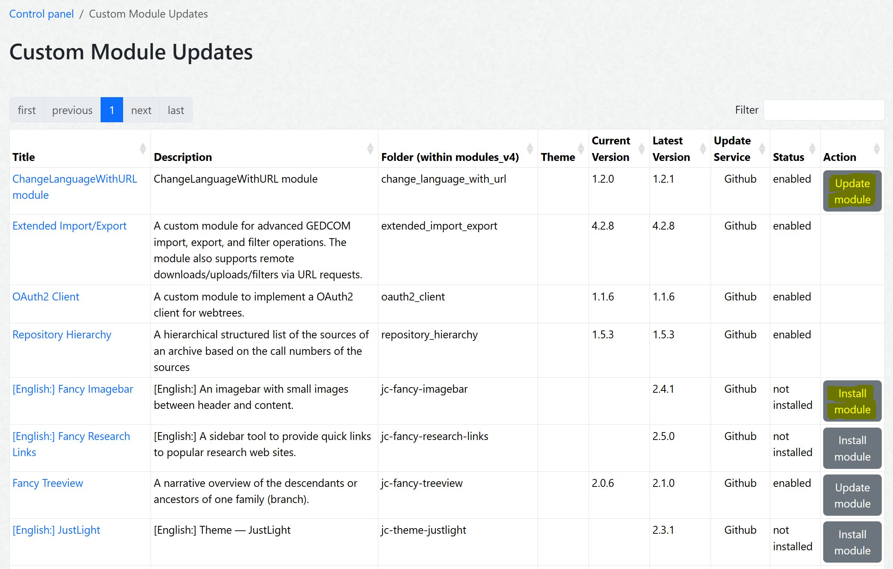

# Custom Module Manager for webtrees
A [webtrees](https://webtrees.net) 2.2 custom module to manage custom modules.

##  Table of contents
This README file contains the following main sections:
+   [What are the benefits of this module?](#what-are-the-benefits-of-this-module)
+   [Installation](#installation)
+   [Github API Token](#github-api-token)
*   [**How to use the module?**](#how-to-use-the-module)
+   [Webtrees Version](#webtrees-version)
+   [Translation](#translation)
+   [Bugs and Feature Requests](#bugs-and-feature-requests)
+   [License](#license)
+   [Github Repository](#github-repository)

## What are the benefits of this module?
**Features:**
+ Support the download of custom modules
+ Support the installation of custom modules
+ Support the update of custom modules

**Optionally planned features:**
+ Provide a full list of all available webtrees custom modules
+ Check the compatibility of custom modules with the webtrees versions
+ Enable/Disable custom modules
+ Save and restore the settings of a custom module

##  Screenshot

## Installation
+ Download the [latest release](https://github.com/Jefferson49/CustomModuleManager/releases/latest) of the module by downloading the "**custom_module_manager_v\*.zip**" file from "Assets". Do not download "Source code.zip".
+ Unzip the downloaded file and copy the included folder custom_module_manager" into the "module_v4" folder of your webtrees installation
+ Check if the module is activated in the control panel:
  + Login to webtrees as an administrator
	+ Go to "Control Panel/All Modules", and find the module called "Custom Module anager"
	+ Check if it has a tick for "Enabled"

## Github API Token

The custom module makes intensive use of the Github API to retrieve module versions and download URLs. However, Github limits the frequency of API calls for a certain IP address. In order to significantly increase the allowed frequency of Github API calls, Github requires to use a Github API token.

The module allows to provide a Github API token in the module settings. In order to get an API token from Github, the following steps need to be taken:

+ Open the [Github](https://github.com/) page and log into your Github account
+ Click on the symbol for your user account on the top right side of the browser
+ Choose "Settings" from the profile menu
+ Choose "Developer settings" on the bottom left side
+ Choose "Personal access tokens"
+ Choose "Tokens (classic)"
+ Click on "Generate new token" button on the right side
+ Choose "Generate new token (classic)"
+ Enter a note, e.g. "API token for webtrees Custom Module Manager"
+ Choose an expiration date. Since the provide rights are unspecific (if you do not select any options), it is acceptable to choose "No expiration" (even if Github does not recommend this).
+ Do NOT select any options
+ Press "Generate token" button at the bottom of the page

##  How to use the module?

+ Got to the module settings
+ Optionally, enter a [Github API token](#github-api-token)
+ Press the "**Manage custom modules**" button

## Webtrees Version
The module was developed and tested with [webtrees 2.1.22 and 2.2.1](https://webtrees.net/download), but should also run with any other 2.2 version.

## Translation
Currently, the following languages are available:
+ English
+ German

You can help to translate this module. The language files are available on [POEditor](https://poeditor.com/join/project/xyz), where you can update them or add new languages.

Alternatively, you can directly edit the .po translation text files, which can be found in [/resources/lang/](resources/lang). You can use a specific editor like [Poedit](https://poedit.net/) or a text editor like notepad++ to work on translations and provide them in the [Github repository](https://github.com/Jefferson49/CustomModuleManager) of the module. You can do this via a pull request (if you know how to do), or by opening a new issue and attaching a .po file. 

Updated translations will be included in the next release of this module.

## Bugs and Feature Requests
If you experience any bugs or have a feature request for this webtrees custom module, you can [create a new issue](https://github.com/Jefferson49/CustomModuleManager/issues).

## License
+ [GNU General Public License, Version 3](LICENSE.md)

This program is free software: you can redistribute it and/or modify it under the terms of the GNU General Public License as published by the Free Software Foundation, either version 3 of the License, or (at your option) any later version.

This program is distributed in the hope that it will be useful, but WITHOUT ANY WARRANTY; without even the implied warranty of MERCHANTABILITY or FITNESS FOR A PARTICULAR PURPOSE. See the GNU General Public License for more details.

You should have received a copy of the GNU General Public License along with this program. If not, see https://www.gnu.org/licenses/.

## Contributions and Copyrights
+ webtrees
    + [webtrees](https://webtrees.net): online genealogy
    + Copyright (c) 2025 [webtrees development team](http://webtrees.net)
+ Vesta Common (webtrees custom module)
    + [Cissee\WebtreesExt\More18N](https://github.com/vesta-webtrees-2-custom-modules/vesta_common/blob/master/patchedWebtrees/MoreI18N.php)
        + Copyright (c) 2019 – 2025 Richard Cissée

## Github Repository
https://github.com/Jefferson49/CustomModuleManager